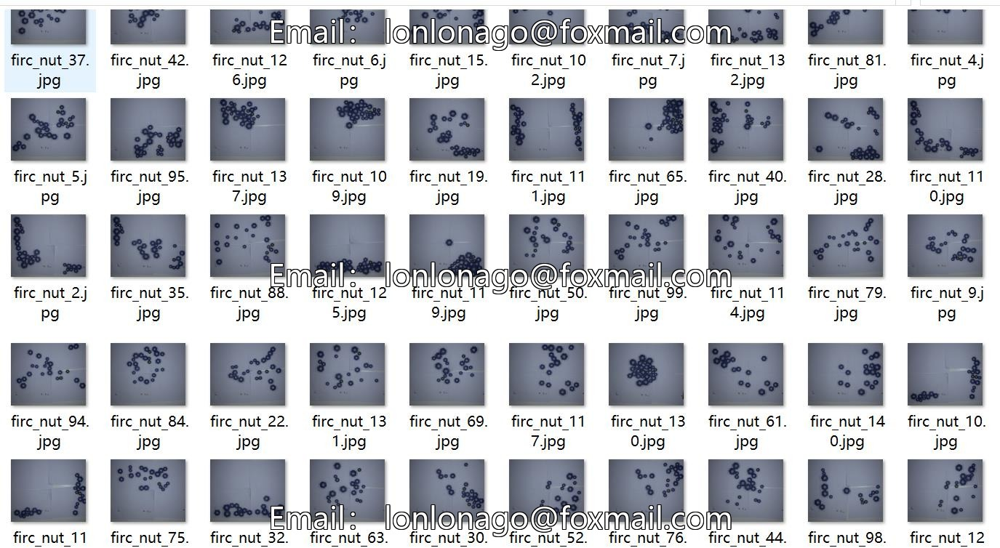
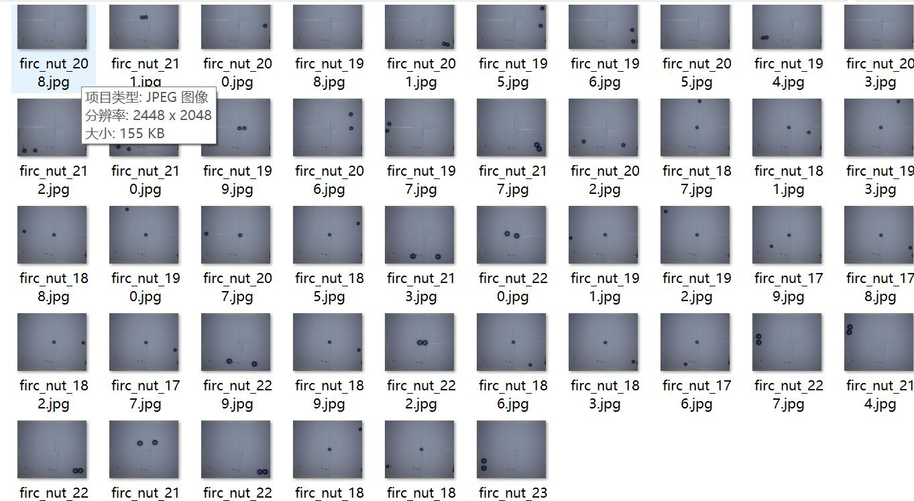
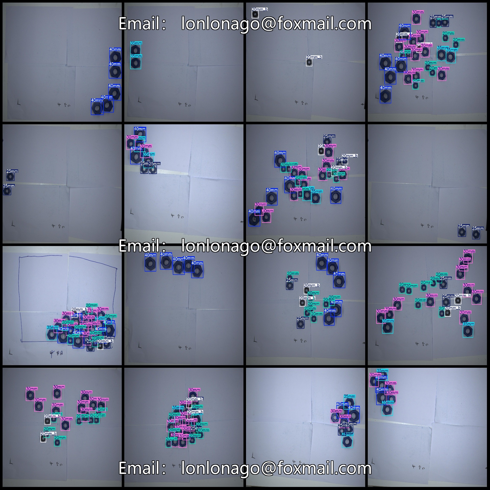

# Screw Size Identification Data Set VOC + YOLO Format, 246 Images, 6 Categories

dataset format: Pascal VOC format+YOLO format
(The txtfile does not contain the path, it only contains the jpgimage and the corresponding VOC formatxmlfile and yolo formattxtfile)
number of images: 246  
annotation count: 246  
Annotation quantity is 246.
annotationnumber of classes: 6  
The warehouse is: firc-dataset
Annotation class names (Note that the order of yolo format classes does not correspond to this, and should be based on the labels file with class.txt): ["20mm", "20mm_b", "25mm", "30mm", "35mm", "40mm"]
boxes per class:   
20mm box count = 763  
20mm_b box count = 254  
To solve this problem, we need to find the relationship between the number of 25mm frames and the total number of 287.

We can express the relationship as:

$ \text{Number of 25mm frames} = \frac{\text{Total number of 287}}{\text{Frame size in mm}}$

Substituting the given values, we get:

$ 25\text{mm frames} = \frac{287}{25}$

To simplify, we divide both sides by 25:

$ 10.4\text{mm frames} = 11.4$

So, the number of 25mm frames required is 11.4.
The problem statement is not clear in English. It seems to be a mathematical expression or a calculation, but there is no specific context provided. Without additional information, it's impossible to provide a solution or interpretation of the given number.

If you could provide more details or clarify the question, I would be happy to assist you with the translation.
35mm box count = 288  
40mm box count = 551  
total boxes: 3233  
## Image
Resolution: 2448x2048
Annotation Tool: labelImg
Annotation Rules: Draw a box around the category
Important Notice: There is no specific information provided.
Special Statement: This dataset does not guarantee the accuracy of the trained model or weight files.
Preview of the image:

Here is a pay link on Stripe ( https://buy.stripe.com/3cs8yP7sY87d0vu9AB ). Please contact me lonlonago@foxmail.com after funding $89, and I will send you a complete data files , thank you!

